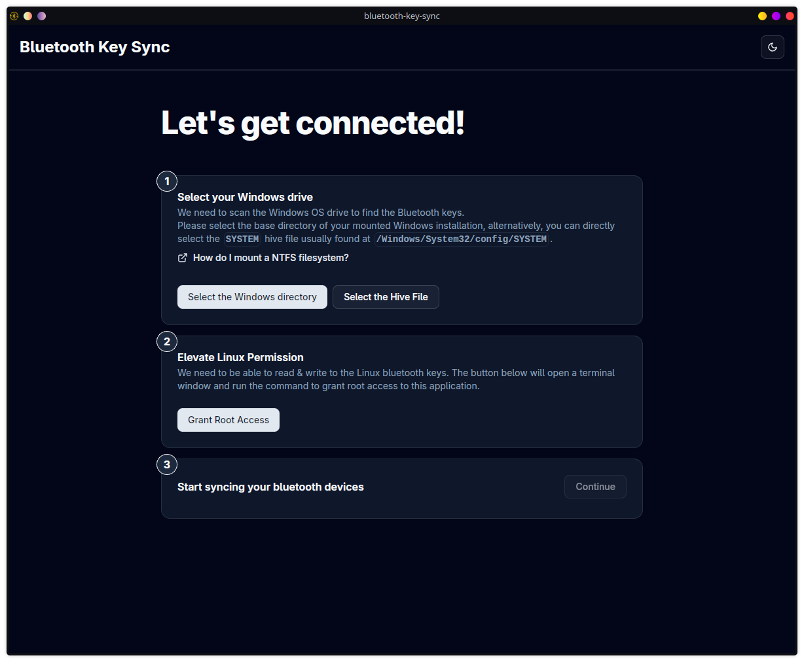
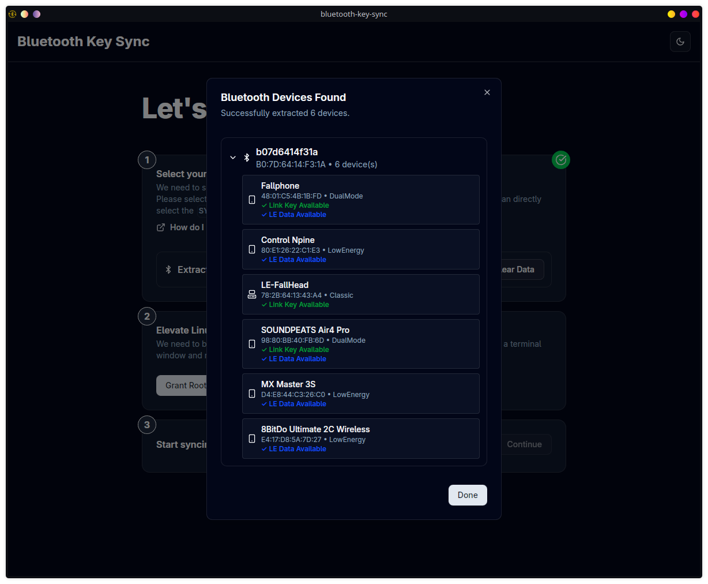

# Bluetooth Key Sync GUI
### A simple & resilient GUI to sync Bluetooth pairing codes between Windows and Linux


| Home Page                      | Windows Scan                      |
| ------------------------------ | --------------------------------- |
|  |  |


## The Why
Ever had to deal with Bluetooth pairing when switching between operating systems? External bluetooth devices treat your machine as the same device, but the pairing codes are stored separately in each OS. I for one, have manually synced these codes for years, [using this fantastic guide](https://unix.stackexchange.com/a/255510/704807), and it was always a hassle.

To quote the author of that guide:

> Basically, when you pair your device, your Bluetooth service generates a unique set of pairing keys. First, your computer stores the Bluetooth device's MAC address and pairing key. Second, your Bluetooth device stores your computer's MAC address and the matching key. This usually works fine, but the MAC address for your Bluetooth port will be the same on both Linux and Windows (it is set on the hardware level). Thus, when you re-pair the device in Windows or Linux and it generates a new key, that key overwrites the previously stored key on the Bluetooth device. Windows overwrites the Linux key and vice versa.

There are many cli tools out there that can help with this, but I've found that *every single one of them* implodes when it encounters a class of device that the Author didn't test.

Not a single one I tested Just Works™ on all my devices, whether it's BlueZ renaming a config value, dual-mode devices with both Classic and LE pairing codes, or the grand-daddy of them all, the dreaded MX Master with a rolling mac address. 

## Project Goals
- Strive for a progressive disclosure UX experience, where new linux users are not overwhelmed with terminology and options, while still providing advanced features for people who used to do this manually.
- Provide a resilient core that can fail gracefully when encountering the many usual edge-cases of Bluetooth pairing.
- Support the following devices:
  - Bluetooth Classic
  - Bluetooth Low Energy
  - Dual-mode devices (both Classic and LE)
  - Devices with rolling mac addresses (like the MX Master)

## Contributing
> Tauri + SvelteKit + TypeScript + Rust = ❤️

To start the project, run:

```bash
pnpm i
pnpm tauri dev
```
